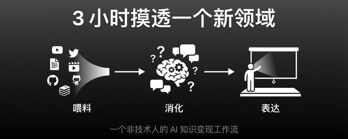
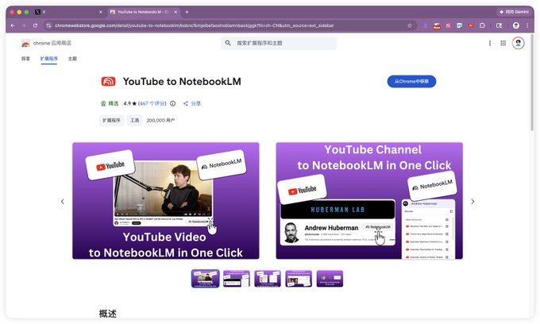
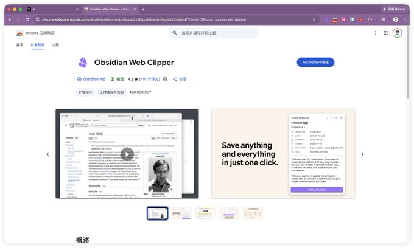
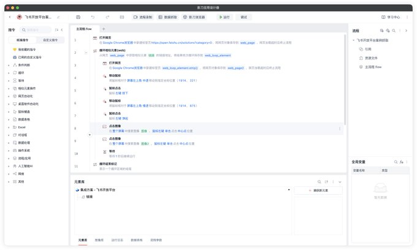
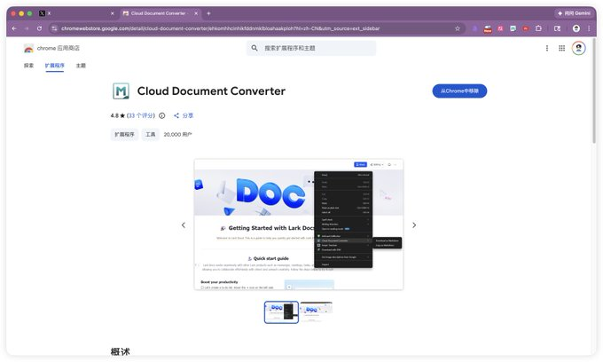
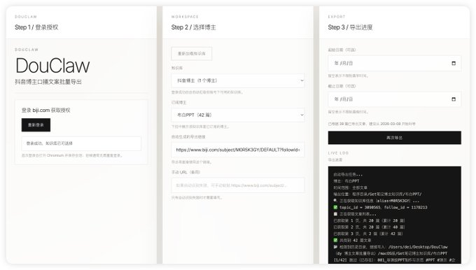
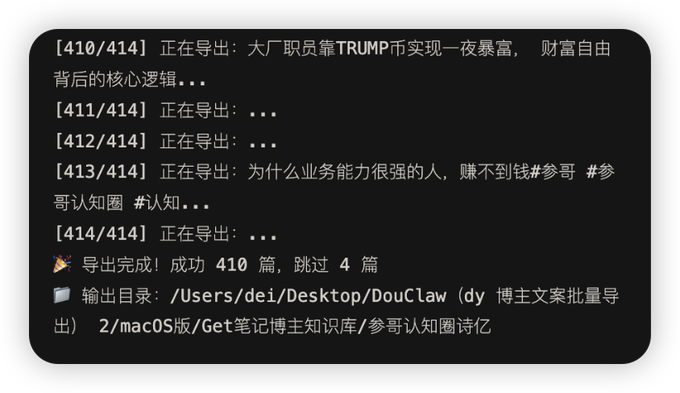
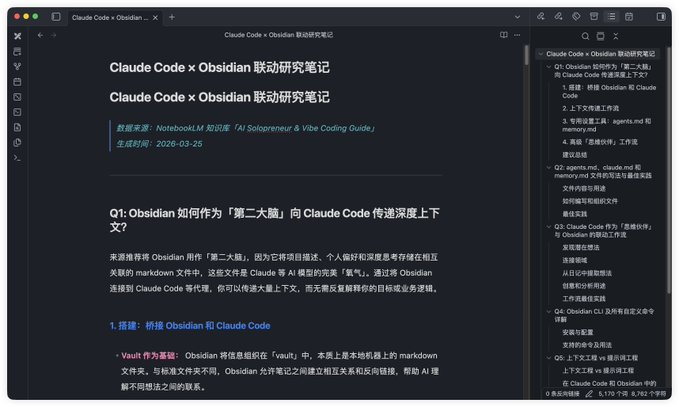
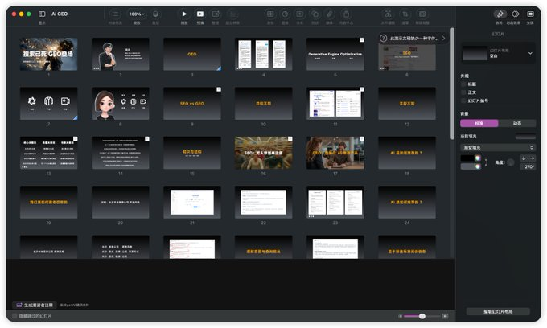
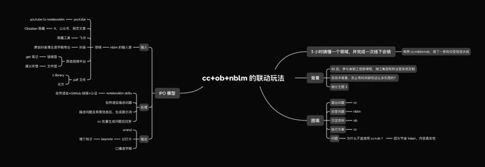

## Article

## Conversation

00 后双非电商专业毕业，每周 4 场 AI 沙龙，我的能力从何而来？

说实话，我也是现学现卖。

但我有一套流水线，能让我三个小时以内摸透一个领域最核心的东西。 去年靠这套方法，录制了国家工信部 AI 智能体证书的课程，搭建了湘江集团整套的矩阵运营系统，近期六位数的费用刚到账。

今天把这套方法论完整公开。 看完之后，你也能搭建属于你自己的内容变现流水线。

过去我也是受大家帮助走过来的，所以希望在稍微有经验的时候，能给大家带来一些启发和灵感。 如果你刚在 AI 领域起步，12 个月前的我就是你最佳的抄袭对象。

多平台信息源 → 全部转成 Markdown → 喂进 NotebookLM 知识库 → Claude Code 批量提问 + 保存答案到本地 → 基于问答创作自己的内容

下面逐步拆解。

我现在研究任何领域，准备每一场线下分享，直接和 Claude Code 对话。

它会基于两三百篇优质文章，或一个博主的全部视频，或某个关键词下的视频进行回答。 所有回答都能完整保持真实性。

我基于这些回答去创作自己的内容，还能接各种 skill，直接转成文章、口播逐字稿、AI 工具最佳实践手册……可以无限延伸。

我观察下来，卡在三个地方：

第一，不会提问。 没有好问题，就不会有好答案。你连该问什么都不知道，AI 再强也帮不了你。

第二，答案不可信。 现在好多 AI 已经被投毒了，没办法基于完整的知识库生成内容，真实性无法保证。你拿着幻觉去讲课，是要翻车的。

第三，知识没有沉淀。 和 AI 在浏览器窗口对话，问题和答案没办法被留下来。下次需要调用，还得重新问一遍。更别说怎么基于这些问答去进一步扩展内容了。

这三个问题，我的工作流全部解决。

我用一个最简单的模型来拆——IPO：输入、处理、输出。 每个普通人都能理解，每个普通人都能落地。

第一步：喂料——打破信息壁垒（耗时：0.5~1 小时）

大模型掌握了尽可能多的信息，但好多信息存在壁垒。 平台之间的壁垒，付费与免费之间的壁垒，传播媒介之间的壁垒——有的是视频，有的是文章。

怎么打破？ 我们以终为始，将所有来源尽可能转化为 AI 最擅长理解的 Markdown 文档。

网页类：三个插件解决一切

油管 → YouTube to NotebookLM 插件

这个插件支持一键导入一个油管博主的全部视频逐字稿到 NotebookLM 知识库，你可以把它理解为国内的 Get 笔记。导入后就能在知识库里对这个博主的全部视频进行提问，适合研究对标博主的整套内容体系。你也可以基于关键词搜索后依次导入，适合研究某个领域的优质内容。使用方法很简单，直接安装插件配置好即可。

推特 / 公众号 / 网页 → Obsidian 剪藏助手

推特长文、公众号文章、普通网页，都可以一键剪藏为本地 Markdown。你还可以搭建 RPA 程序进行批量剪藏——比如我要分析飞书的开发案例，搭建好 RPA 后把电脑放在那，它就能自己工作了。

飞书文档 → Cloud Document Converter

飞书文章容易被设置权限，Obsidian 剪藏助手搞不定。这个插件能帮你破除权限限制，直接以 Markdown 形式保存到本地。

基本上这三个插件就能解决所有网页文档的剪藏。

视频类：链接提取 or 文件提取，总能搞定

链接提取： B 站长视频、小宇宙播客等，直接把链接发给 Get 笔记，就能提取全部逐字稿。抖音也一样，Get 笔记支持一键提取抖音博主全部逐字稿，但都是在线的。我用 Claude Code 做了一个 app，支持一键将抖音博主全部视频的逐字稿导入本地。

文件提取： 有些视频没有链接，或者链接不支持直接提取。最简单的方法是先用下载狗、GreenVideo 等工具把视频下载下来，再上传到通义听悟进行逐字提取。这是底层通用方案——所有视频归根结底都是文件，只要有源文件，一定能提取出来。

这样就完成了喂料。

第二步：消化——NotebookLM × Claude Code 联动（耗时：1~2 小时）

所有输入的内容都可以放到 NotebookLM 知识库里。

为什么选 NotebookLM？三个原因：

第一，绝不产生幻觉。 完全基于你喂进去的真实材料生成内容，每个答案都能在原文中找到溯源，右上角标注好位置，点击就能跳转查看。

第二，接的是 Gemini 模型，长文本处理效果很好。 好多 AI 你上传几十个文档它就不知道里边说的什么了，NotebookLM 可以上传 300 个文档。

第三，输出格式丰富。 支持音频、视频、幻灯片等多种格式。

核心玩法：让 AI 帮你提问

处理环节最大的问题，还是前面说的——好多人不知道怎么提问。

我的方法是：直接让 AI 帮我提出一系列好的问题。

描述一个主题，让 AI 生成一系列问题，然后 NotebookLM 基于知识库给出答案，保存到本地。 就像学术研究里的"交叉质询"——AI 提问，知识库举证，我来审判。

怎么实现的？

首先给 Claude Code 接上 NotebookLM 知识库。直接复制这个链接发给你的 Claude Code，让它帮你安装，按步骤完成认证登录即可。

安装好后，和网页端一样提问就行了。我日常的用法是：让它帮我批量生成问题，批量作答。我只需要看对应的问题和答案。它相较我而言能生成更全面更深入的问题。

我还增加了一个要求：不只是在线提问，而是把问题和答案以本地文件的形式保存下来，方便以后直接做成知识库。

为什么不直接用 Claude Code 读文档？

很多人问：Claude Code 也可以基于这些文档生成内容，为什么还要接 NotebookLM？

核心原因是省钱。

直接用 Claude Code 读几百篇文档，极其耗费 token。接上 NotebookLM 知识库后，Claude Code 只负责提问，拿到答案后保存到本地就行了，token 消耗大幅降低。

这样处理环节就搞定了。 每次我只需要提要求，它就帮我扩展问题、调用知识库、生成答案并保存到本地。 我可以直接查阅，下次还能将其作为新的知识库材料。 知识是会复利的——你的库越厚，下次研究的起点就越高。

第三步：表达——用 AI 做研究，用人做表达（耗时：1~2 小时）

拿到问题和答案后，实操方面的内容，我会直接去实践一遍。

如果要讲认知层面的内容，我用自己的理解整理成 Xmind 思维导图，再进一步整理为幻灯片。

但好多人是直接让 NotebookLM 生成幻灯片、生成逐字稿，然后去现场放在幻灯片注释里直接念。 我不喜欢这种方式。 真正体验过你就知道，这根本行不通。 很死板，就是个念稿的，自己都不知道自己讲的是什么，而且当每页都是重点的时候，就没有重点了，根本不关心听众是否理解。

我的做法是：

先写 Xmind 逐字稿，保证表达框架是我的。 这样我不需要去顺应 AI 生成 PPT 的垃圾框架。

然后用语音输入法（闪电说）或者语音转文字（千问录音），照着思维导图，把我对内容的理解自己输出一遍。 这个过程活人味很足，得到的是一篇完全符合我表达风格的逐字稿。 稍微修改一下，到时候直接即兴讲就行。

最后手搓 Keynote 幻灯片。

为什么用 Keynote？因为它够简单，比 PowerPoint 好用多了。 我一直有个观点：如果你觉得 NotebookLM 生成的幻灯片好的话，要么你压根不懂表达，要么你只用过 PowerPoint。

手搓的好处：完全符合我的表达逻辑，手搓过程本身就是梳理内容的过程，同时能控制好观众的注意力，因为它足够简约，使用动画渐进式显现，观众的眼睛会完美契合你的演讲节奏。

有时间我也可以给大家分享一下我是如何制作幻灯片的。

从喂料到消化到表达，全套闭环就是这样。 如果有想研究的领域，有想分享的内容，完全可以用这套工作流完成知识变现。

运用 AI 是一种能力。 但让 AI 帮你变强的同时，不丢掉自己的表达——这是另一种能力。

> 用 AI 做研究，用人做表达。

这篇内容就是基于我 Xmind → 口播逐字稿的方法论写出来的。有些环节由于篇幅原因没有最细化，大家可以在评论区反馈：哪里写得好，哪里没写全，方便我以后做更详细的分享。

我是观自，00 后，一个农村小伙，AI 领域的创业者，刚来到推特。 专注于 AI 赋能培训与 AI 自动化运营系统定制。 阅读过程中对于 AI 有任何问题，或者有插件方面的需求，都可以联系我。
