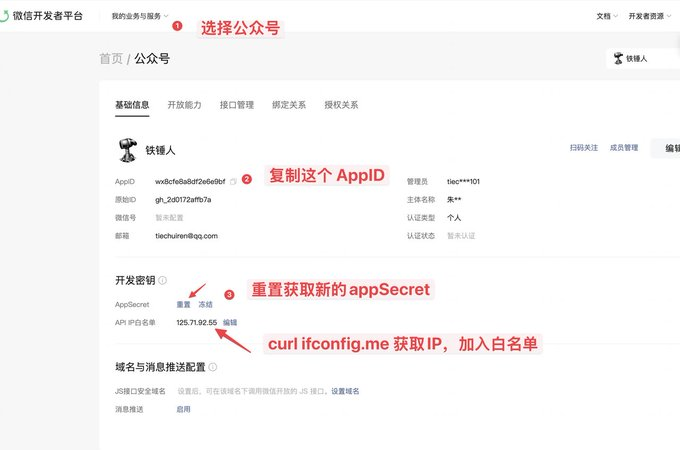
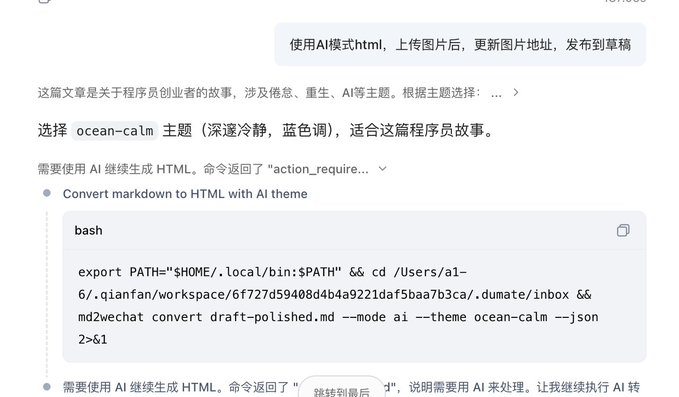
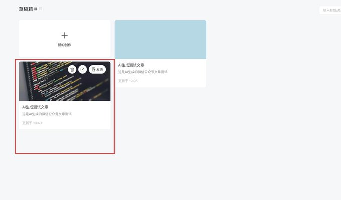
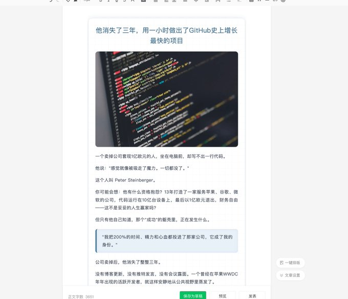

## Article

## Conversation

[](https://x.com/lxfater/article/2037047059384328315/media/2037047046163910656)

这个 开源Skill，自动排版，发送到公众号草稿，不花一分钱

你是不是想发公众号，但是排版起来很麻烦。

然后你没有发，就在 X 上发，就被别人搬运了。

别人轻松靠你的文章赚个几千块。

铁锤人

@lxfater

我操，立马被搬运了，我自己的都发不出来

[](https://x.com/lxfater/status/2016025966431383779/photo/1)

Quote

铁锤人

@lxfater

Jan 27


送你保姆级的Clawdbot 的部署教程（免得在闲鱼买）

你知道部署 Clawdbot 的收费教程，在闲鱼卖多少钱吗？ 几个十几元到几元不等。 今天我铁锤就熬夜带你跑通Clawdbot 的本地部署和使用，你拿去赚钱也好，使用也好，随便你。 本次教程主要分为三部： 1. 安装...

没关系我也经历过，所以我特地花时间研究一下，如何解决这个问题。

你可能以为要很多钱，部署很难，但其实只要一句话，你的 OpenClaw，Claude code 就能安装上这个 Skill。

话不多说，下面演示

1.   在任何支持 Agent Skill 的软件，安装这个 Skill

2.   解决你不会配置的难题

3.   演示如何排版发送到公众号

我们的这个 Skill 也是推友的作品，算是一个生态的产品，但今天要讲白嫖的思路，所以先给人家打个广告。

极客杰尼

@seekjourney


我把公众号排版Skill上架到了ClawHub

大家好，我是极客杰尼。 周末 md2wechat 2.0.0 正式发布，并且上架到 OpenClaw 官方技能库 ClawHub。 这次 2.0.0，解决的是好用的问题。 2.0.0 到底升级了什么 一句话说：从一个排版工具，变成了面向 AI Agent...

安装这个 Skill 很简单，就是在任何支持 Skill 的软件输入下面一句话

markdown

```
请帮我安装 md2wechat 并验证可用。按这个顺序执行：
1. 运行：curl -fsSL https://github.com/geekjourneyx/md2wechat-skill/releases/download/v2.0.4/install.sh | bash
2. 运行：npx skills add https://github.com/geekjourneyx/md2wechat-skill --skill md2wechat
3. 运行：export PATH="$HOME/.local/bin:$PATH"
4. 运行：md2wechat version --json
5. 运行：md2wechat config init
6. 运行：md2wechat capabilities --json
如果某一步失败，请直接告诉我失败原因和下一步修复命令，不要省略命令。
```

很快就安装完毕了

但是为了是能够自动将草稿发送到微信公众号，我们还需要下面的两个密钥：

[](https://x.com/lxfater/article/2037047059384328315/media/2037043729140441089)

1. 转移到

[](https://x.com/lxfater/article/2037047059384328315/media/2037044043281268736)

2. 登陆后按照下面步骤获取变量

[](https://x.com/lxfater/article/2037047059384328315/media/2037044122809450496)

如何配置这两个变量呢？ 一句话 WECHAT APPID：xxx，WECHAT_SECRET：xx，帮我配置一下。 AI 就自动弄好了

直接输入：使用AI模式html，上传图片后，更新图片地址，发布到草稿

当然，也可以使用 API 模式，这个时候就要支持作者付款了。

下面显示如何操作

[](https://x.com/lxfater/article/2037047059384328315/media/2037044199389093888)

最后，成功推送文章草稿

[](https://x.com/lxfater/article/2037047059384328315/media/2037044284076261376)

这个时候进去，改改标题，改改封面就能发布，给大家看看效果

[](https://x.com/lxfater/article/2037047059384328315/media/2037044325792833538)

这套流程是我目前用得最好的流程，不需要安装各种环境，成功率极高。

好了，今天的的分享到此为止，希望对大家有帮助。

也可以关注我的公众号，我会分享更多类似的内容。 里面也有 AI 社群。

[](https://x.com/lxfater/article/2037047059384328315/media/2037044742824046592)
