# jenniekusu on X: "免费雇佣了一个GTM Engineer，为我今年立省20万美金" / X

- Source: https://x.com/jenniekusu/status/2033575709378019542
- Captured at: 2026-03-17T00:22:43.637195+08:00

## Content

最近在X刷到了很多招 GTM Engineer 的帖子，阅读量很高，评论区人才很多，大家都很焦虑。

[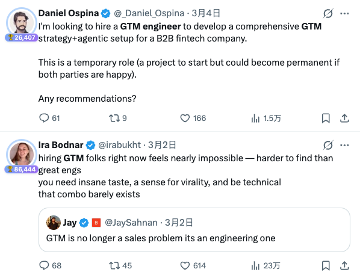](https://x.com/jenniekusu/article/2033575709378019542/media/2033557954226487297)

我看这是直接在昭告世界：GTM 不再是一个纯粹的销售和市场增长岗位，而是变成了一个和工程结合紧密的高需求融合岗位。

Google了一下现在市场上关于 GTM Engineer 在各种类型公司里的平均年薪，最低 10 万美金起，最高能到20多万美金：

[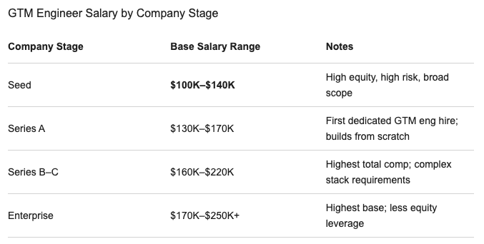](https://x.com/jenniekusu/article/2033575709378019542/media/2033556864311361536)

然后我继续随手 Google 了一下，要怎么样才能找到一个 GTM Engineer，结果图里面这个引起了我的注意：

[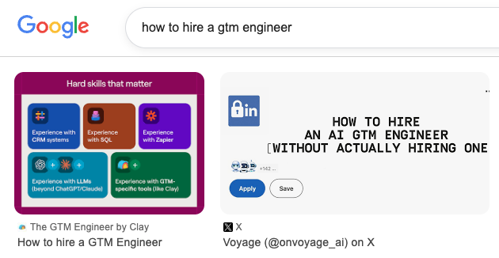](https://x.com/jenniekusu/article/2033575709378019542/media/2033565252126949376)

这不是

前段时间刚刚发布的 GTM Engineer Skills吗？

Voyage

@onvoyage_ai

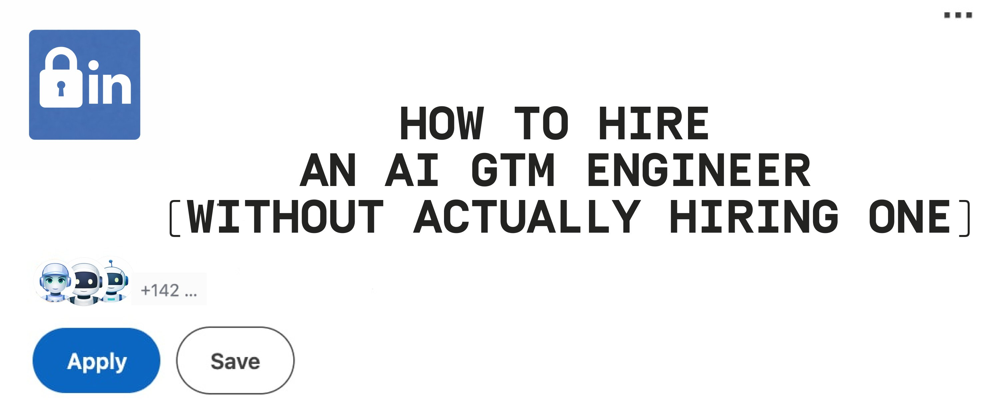

How to Hire an AI GTM Engineer (Without Actually Hiring One)

1. Why Companies Are Suddenly Hiring AI GTM Engineers The hottest role in GTM right now isn’t Head of Growth. It’s the GTM Engineer. OpenAI’s Go-To-Market roles average $252k–$296k per year. At...

看了一下GitHub repo，更新了不少新鲜的skills：

正好最近刚刚把

官网做出来，想着怎么样能让这个官网帮我触达更多伦敦本地想来参加活动的人和相应的合作伙伴/赞助商，因为这个活动还是我自己为爱发电还没有任何收入，我肯定也不想花钱去招一个帮我做SEO/GEO/AEO的人，于是就拿着这套开源GTM Engineer Skills玩起来了。

先给你们看一下这个网站原始的样子：

非常简洁、信息清晰的四页静态网站，里面的内容都是我自己觉得比较重要，且需要展示给看这个网站的人的内容。

[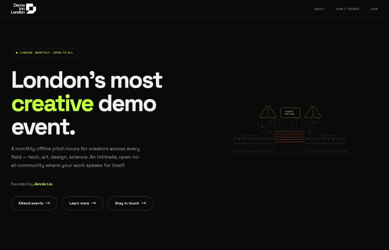](https://x.com/jenniekusu/article/2033575709378019542/media/2033568431493050369)

[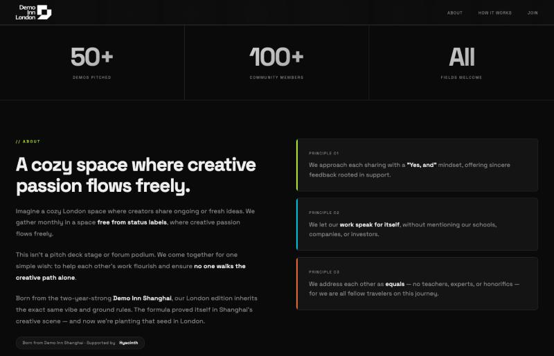](https://x.com/jenniekusu/article/2033575709378019542/media/2033568494965460992)

[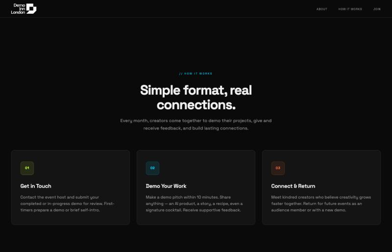](https://x.com/jenniekusu/article/2033575709378019542/media/2033568537214627840)

[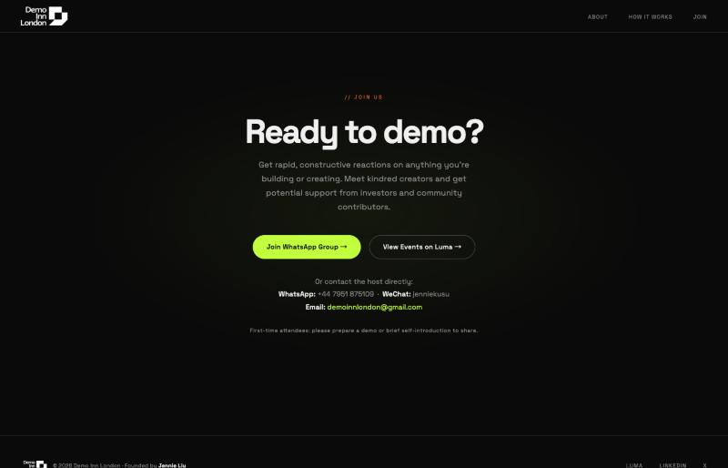](https://x.com/jenniekusu/article/2033575709378019542/media/2033568575865417730)

按照 GitHub 里面的指示，我先让自己的 Claude Code 安装了这些 skills，先开始跑了这个网站的GEO/AEO审计。

[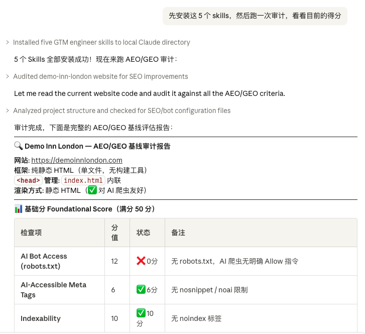](https://x.com/jenniekusu/article/2033575709378019542/media/2033569591830667264)

[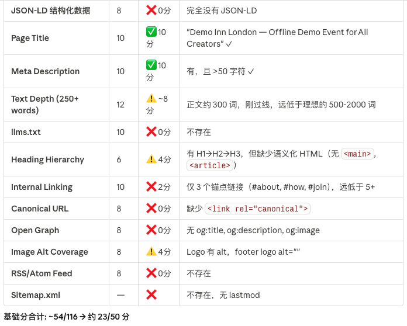](https://x.com/jenniekusu/article/2033575709378019542/media/2033569796579602432)

[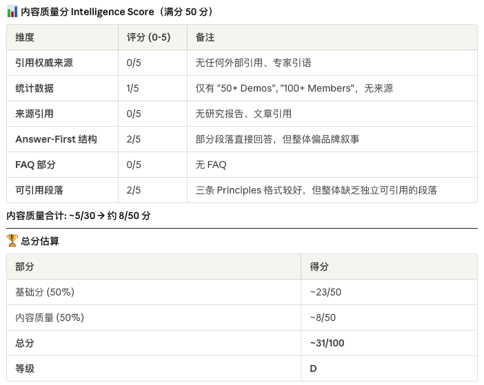](https://x.com/jenniekusu/article/2033575709378019542/media/2033569852733128704)

最后得分是 31 分，属于是极度不合格。于是，我开始跟着 skills 的步骤，一一进行优化。

[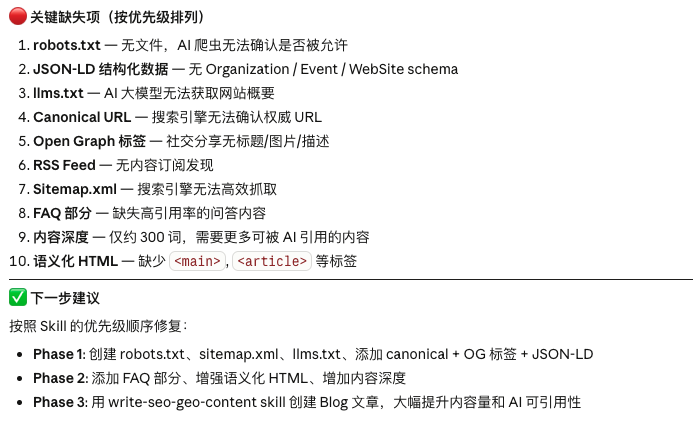](https://x.com/jenniekusu/article/2033575709378019542/media/2033570518155014144)

在这个阶段，主要在网站前端增加了一个 FAQ 的内容部分。相当于开始有一些更好地可以自动被 AI 索引的信息。

[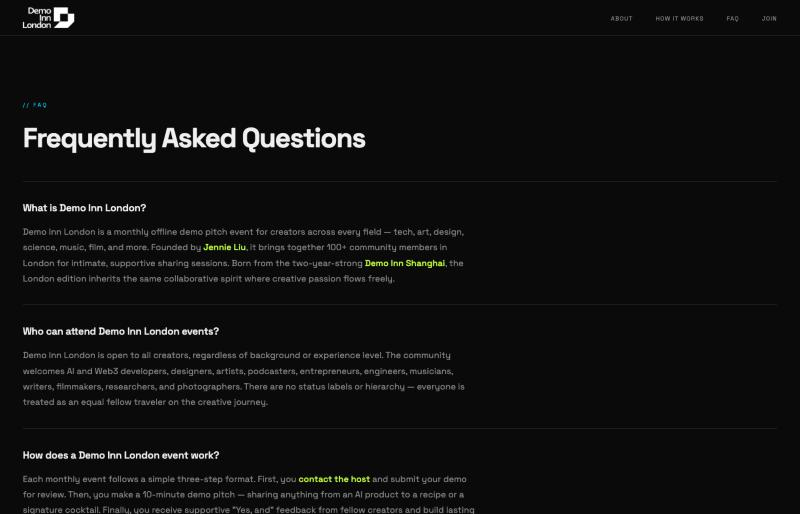](https://x.com/jenniekusu/article/2033575709378019542/media/2033570837979189248)

同时，在代码部分也进行了一定的优化。

[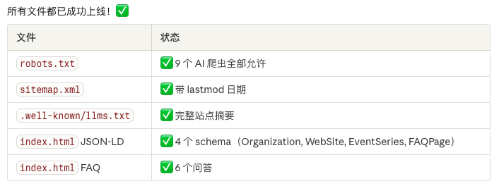](https://x.com/jenniekusu/article/2033575709378019542/media/2033571032859123713)

这个阶段结束之后，完整的审计评分直接从31分拉上了及格线66分。

[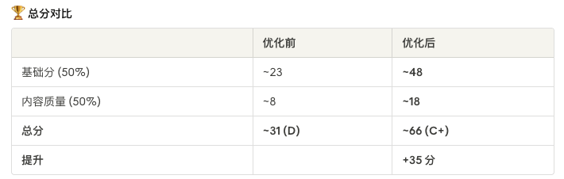](https://x.com/jenniekusu/article/2033575709378019542/media/2033571240695250944)

无论在传统SEO还是现在的GEO/AEO流程中，关键词研究都是很重要的一环，这部分可以非常清晰地知道，在官网Blog 的撰写中要围绕什么样的关键词和趋势去写。这部分特别考验团队中，对于社交媒体或者最近讨论度比较高的一些话题的关注度和敏感度。

一开始，Claude Code 根据 Demo Inn London 核心的一些概念（比如 creator 或者 creative events）去做了一些关键词的搜索。出来的结果比较 general，但也帮我理清了一些可以拿来做文章撰写的思路。

然后我想到，最近我关注到推特上，由于 OpenClaw创始人 Peter 在伦敦参加黑客松活动之后，关于伦敦的讨论越来越多，越来越多的 base 在伦敦本地的创业者、初创公司、大公司和投资人都开始发布关于 Londonmaxxing 的推文。

比如

这篇：

GRITCULT

@GRITCULT

THE BULL CASE FOR LONDON: Why its only going to get better.

A lot of doomer slop is going around about the UK and london, have been meaning to address this for a while, because i see a different picture. After this tweet going viral, and a lot of people...

所以 “Londonmaxxing” 这个词，对于伦敦本地的用户和在伦敦做活动的受众来说，是一个非常值得探索的关键词。但这仅仅是我自己的观察，没想到我在 Claude 给我的 Keyword Research 里面，也看到了关于这个关键词延展出来的高度潜力。

[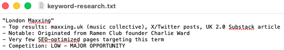](https://x.com/jenniekusu/article/2033575709378019542/media/2033572379633532928)

[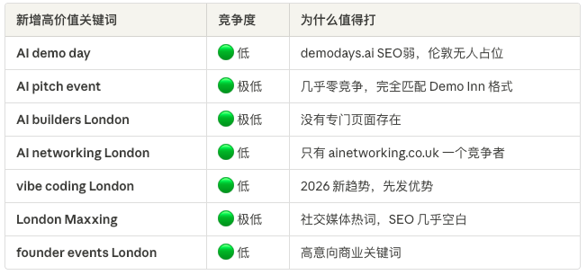](https://x.com/jenniekusu/article/2033575709378019542/media/2033572425997103104)

所以这些竞争度低、但是价值又很高的关键词，可能是接下来最值得去铺开内容的方向。

经过了对于关键词的洞察和文章内容的讨论和优化，初步在官网上线了三篇博客文章，这些文章里都嵌入了非常好看的数据卡片和对比表格，让整个文章的可读性和观赏性都接近了完美的网站适配性。

[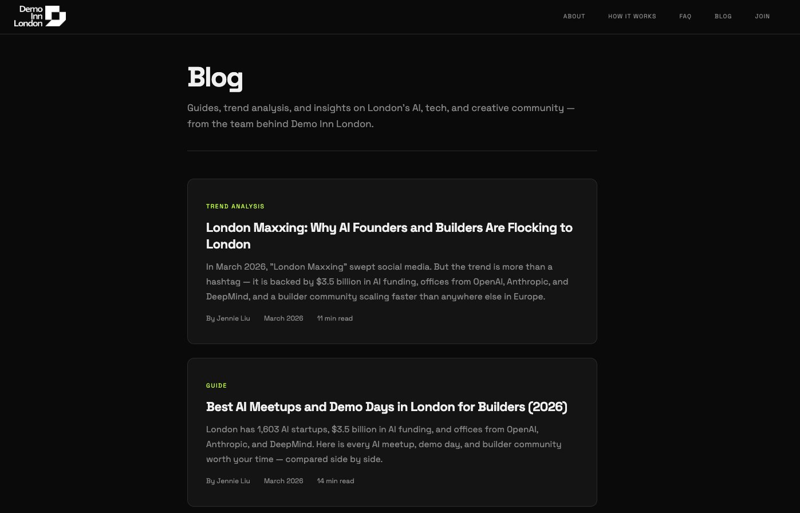](https://x.com/jenniekusu/article/2033575709378019542/media/2033572774933876736)

[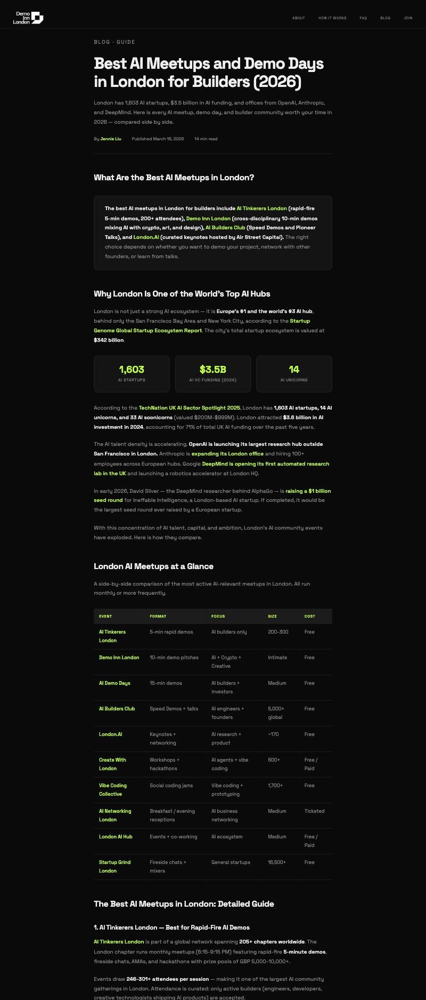](https://x.com/jenniekusu/article/2033575709378019542/media/2033574056729931778)

上线文章之后，整体网站的得分已经接近满分。

[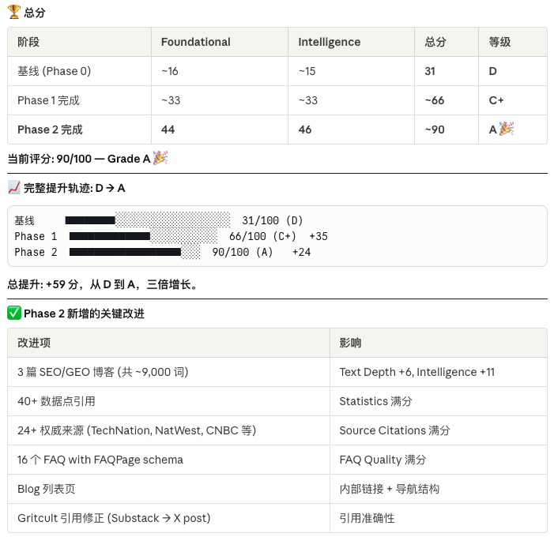](https://x.com/jenniekusu/article/2033575709378019542/media/2033573254242201600)

这要是搁以前，我得花多大精力去找到这样一个专家和工程师来帮我搞定这一，我只用了不到一个小时，就做了这么多事情。

感谢AI和Claude ，感谢 Voyage 的 GTM Engineer Skills，让我今年直接省了 20 万美金（雇一个 GTM Engineer 的成本），后面我会持续更新一下这个网站的流量变化情况，也帮助 Voyage 持续优化这个 skills，让更多团队能无痛、快速、高效地为自己团队构建一个专业的 GTM Engineer Agent。

## Images (archived)

